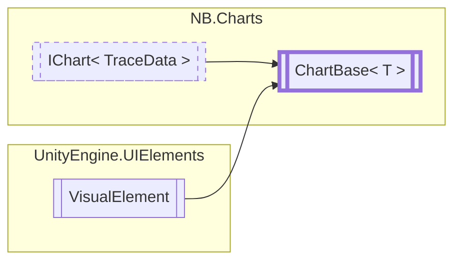

# ChartBase&lt;T&gt; `class`

## Description
Base implementation for all charts

## Diagram


## Members
### Properties
#### Public  properties
| Type | Name | Methods |
| --- | --- | --- |
| `string` | [`AxisLabelBottom`](#axislabelbottom) | `get, set` |
| `string` | [`AxisLabelLeft`](#axislabelleft) | `get, set` |
| `string` | [`AxisLabelRight`](#axislabelright) | `get, set` |
| `string` | [`AxisLabelTop`](#axislabeltop) | `get, set` |
| [`Palettes`](./nbcharts-Palettes.md) | [`ColorPalette`](#colorpalette) | `get, set` |
| `bool` | [`ShowLegend`](#showlegend) | `get, set` |

### Methods
#### Protected  methods
| Returns | Name |
| --- | --- |
| `void` | [`DrawChart`](#drawchart)(`Painter2D` p, `MeshGenerationContext` mgc, `Vector2` dataRangeX, `Vector2` dataRangeY, `Vector2` eleRangeX, `Vector2` eleRangeY) |
| `void` | [`GenerateVisualContent`](#generatevisualcontent)(`MeshGenerationContext` mgc) |
| `float` | [`MapRange`](#maprange)(`float` v, `Vector2` fromRange, `Vector2` toRange) |
| `void` | [`MarkDirty`](#markdirty)()<br>Schedules this chart for a repaint and regeneration all visuals. This may be called more than once<br>            during a single frame without incurring any additional costs.<br>            Depending on the chart type and complexity of the visualization, this may occur over multiple frames. |
| `void` | [`OnRefreshVisuals`](#onrefreshvisuals)() |

#### Public  methods
| Returns | Name |
| --- | --- |
| `void` | [`HideTooltip`](#hidetooltip)()<br>Hides any open tooltip on the chart. |
| `void` | [`RemoveDataSeries`](#removedataseries)(`string` series) |
| `void` | [`SetColor`](#setcolor)(`Color` color, `string` series) |
| `void` | [`SetData`](#setdata)(`T` data, `string` series) |
| `void` | [`SetVisibility`](#setvisibility)(`string` series, `bool` visible) |
| `void` | [`ShowTooltip`](#showtooltip)(`Vector2` pos, `string` text)<br>Displays a tooltip on the chart. |
| `void` | [`ToggleVisibility`](#togglevisibility)(`string` series) |

## Details
### Summary
Base implementation for all charts

### Inheritance
 - [`IChart`](./nbcharts-IChartT.md)&lt;`T`&gt;
 - `VisualElement`

### Nested types
#### Classes
 - `UxmlTraits`

### Constructors
#### ChartBase
```csharp
public ChartBase()
```

### Methods
#### MapRange
```csharp
protected float MapRange(float v, Vector2 fromRange, Vector2 toRange)
```
##### Arguments
| Type | Name | Description |
| --- | --- | --- |
| `float` | v |   |
| `Vector2` | fromRange |   |
| `Vector2` | toRange |   |

#### SetColor
```csharp
public virtual void SetColor(Color color, string series)
```
##### Arguments
| Type | Name | Description |
| --- | --- | --- |
| `Color` | color |   |
| `string` | series |   |

#### SetVisibility
```csharp
public virtual void SetVisibility(string series, bool visible)
```
##### Arguments
| Type | Name | Description |
| --- | --- | --- |
| `string` | series |   |
| `bool` | visible |   |

#### ToggleVisibility
```csharp
public virtual void ToggleVisibility(string series)
```
##### Arguments
| Type | Name | Description |
| --- | --- | --- |
| `string` | series |   |

#### SetData
```csharp
public virtual void SetData(T data, string series)
```
##### Arguments
| Type | Name | Description |
| --- | --- | --- |
| `T` | data |   |
| `string` | series |   |

#### RemoveDataSeries
```csharp
public virtual void RemoveDataSeries(string series)
```
##### Arguments
| Type | Name | Description |
| --- | --- | --- |
| `string` | series |   |

#### ShowTooltip
```csharp
public void ShowTooltip(Vector2 pos, string text)
```
##### Arguments
| Type | Name | Description |
| --- | --- | --- |
| `Vector2` | pos | Location, relative to the chart element, to display the tooltip. |
| `string` | text | Text to display in the tooltip. |

##### Summary
Displays a tooltip on the chart.

#### HideTooltip
```csharp
public void HideTooltip()
```
##### Summary
Hides any open tooltip on the chart.

#### GenerateVisualContent
```csharp
protected abstract void GenerateVisualContent(MeshGenerationContext mgc)
```
##### Arguments
| Type | Name | Description |
| --- | --- | --- |
| `MeshGenerationContext` | mgc |   |

#### DrawChart
```csharp
protected abstract void DrawChart(Painter2D p, MeshGenerationContext mgc, Vector2 dataRangeX, Vector2 dataRangeY, Vector2 eleRangeX, Vector2 eleRangeY)
```
##### Arguments
| Type | Name | Description |
| --- | --- | --- |
| `Painter2D` | p |   |
| `MeshGenerationContext` | mgc |   |
| `Vector2` | dataRangeX |   |
| `Vector2` | dataRangeY |   |
| `Vector2` | eleRangeX |   |
| `Vector2` | eleRangeY |   |

#### OnRefreshVisuals
```csharp
protected virtual void OnRefreshVisuals()
```

#### MarkDirty
```csharp
protected virtual void MarkDirty()
```
##### Summary
Schedules this chart for a repaint and regeneration all visuals. This may be called more than once
            during a single frame without incurring any additional costs.
            Depending on the chart type and complexity of the visualization, this may occur over multiple frames.

### Properties
#### AxisLabelBottom
```csharp
public virtual string AxisLabelBottom { get; set; }
```

#### AxisLabelLeft
```csharp
public virtual string AxisLabelLeft { get; set; }
```

#### AxisLabelRight
```csharp
public virtual string AxisLabelRight { get; set; }
```

#### AxisLabelTop
```csharp
public virtual string AxisLabelTop { get; set; }
```

#### ColorPalette
```csharp
public virtual Palettes ColorPalette { get; set; }
```

#### ShowLegend
```csharp
public virtual bool ShowLegend { get; set; }
```
