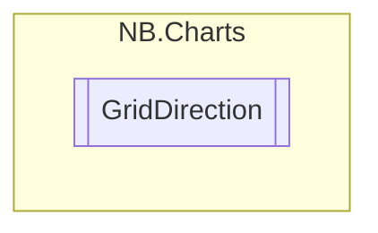

# GridDirection `enum`

## Diagram

```mermaid
  flowchart LR
  classDef interfaceStyle stroke-dasharray: 5 5;
  classDef abstractStyle stroke-width:4px
  subgraph NB.Charts
  NB.Charts.GridDirection[[GridDirection]]
  end
```

## Details
### Fields
#### Horizontal

#### Vertical

