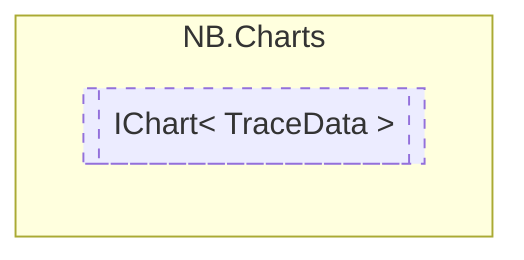

# IChart&lt; TraceData&gt; `interface`

## Description
Base interface for all chart types

## Diagram


## Members
### Properties
#### Public  properties
| Type | Name | Methods |
| --- | --- | --- |
| `string` | [`AxisLabelBottom`](#axislabelbottom)<br>Text to display below the chart. | `get, set` |
| `string` | [`AxisLabelLeft`](#axislabelleft)<br>Text to display to the left of the chart. | `get, set` |
| `string` | [`AxisLabelRight`](#axislabelright)<br>Text to display to the right of the chart. | `get, set` |
| `string` | [`AxisLabelTop`](#axislabeltop)<br>Text to display above the chart. | `get, set` |
| [`Palettes`](./nbcharts-Palettes.md) | [`ColorPalette`](#colorpalette)<br>Color palette to use.<br>            By selecting a built-in color palette, you do not need to explicitly set<br>            the color of each series in your chart. | `get, set` |
| `bool` | [`ShowLegend`](#showlegend)<br>Whether or not to display a legend inside the chart. | `get, set` |

### Methods
#### Public  methods
| Returns | Name |
| --- | --- |
| `void` | [`RemoveDataSeries`](#removedataseries)(`string` series)<br>Removes and clears all data associated with the given series. |
| `void` | [`SetColor`](#setcolor)(`Color` color, `string` series)<br>Sets the color used when displaying the given series.<br>            Overrides any palette options. |
| `void` | [`SetData`](#setdata)(`TraceData` data, `string` series) |
| `void` | [`SetVisibility`](#setvisibility)(`string` series, `bool` visible)<br>Sets whether a specific series should be visible or not. |
| `void` | [`ToggleVisibility`](#togglevisibility)(`string` series)<br>Toggles the visibility of the given series. |

## Details
### Summary
Base interface for all chart types

### Generic types
| Type | Description | Constraints |
| --- | --- | --- |
| `TraceData` | The type used for data consumed by a chart |  |

### Methods
#### SetData
```csharp
public void SetData(TraceData data, string series)
```
##### Arguments
| Type | Name | Description |
| --- | --- | --- |
| `TraceData` | data |   |
| `string` | series |   |

#### SetVisibility
```csharp
public void SetVisibility(string series, bool visible)
```
##### Arguments
| Type | Name | Description |
| --- | --- | --- |
| `string` | series |  |
| `bool` | visible |  |

##### Summary
Sets whether a specific series should be visible or not.

#### ToggleVisibility
```csharp
public void ToggleVisibility(string series)
```
##### Arguments
| Type | Name | Description |
| --- | --- | --- |
| `string` | series |  |

##### Summary
Toggles the visibility of the given series.

#### RemoveDataSeries
```csharp
public void RemoveDataSeries(string series)
```
##### Arguments
| Type | Name | Description |
| --- | --- | --- |
| `string` | series |  |

##### Summary
Removes and clears all data associated with the given series.

#### SetColor
```csharp
public void SetColor(Color color, string series)
```
##### Arguments
| Type | Name | Description |
| --- | --- | --- |
| `Color` | color |  |
| `string` | series |  |

##### Summary
Sets the color used when displaying the given series.
            Overrides any palette options.

### Properties
#### AxisLabelBottom
```csharp
public string AxisLabelBottom { get; set; }
```
##### Summary
Text to display below the chart.

#### AxisLabelLeft
```csharp
public string AxisLabelLeft { get; set; }
```
##### Summary
Text to display to the left of the chart.

#### AxisLabelRight
```csharp
public string AxisLabelRight { get; set; }
```
##### Summary
Text to display to the right of the chart.

#### AxisLabelTop
```csharp
public string AxisLabelTop { get; set; }
```
##### Summary
Text to display above the chart.

#### ColorPalette
```csharp
public Palettes ColorPalette { get; set; }
```
##### Summary
Color palette to use.
            By selecting a built-in color palette, you do not need to explicitly set
            the color of each series in your chart.

#### ShowLegend
```csharp
public bool ShowLegend { get; set; }
```
##### Summary
Whether or not to display a legend inside the chart.
