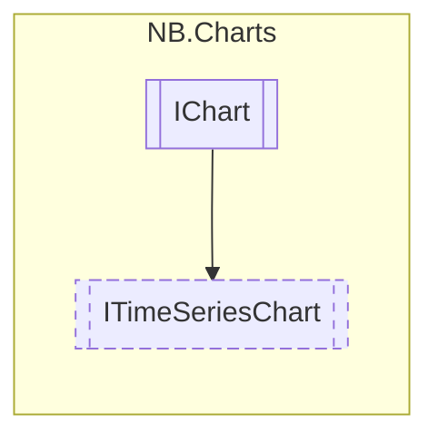

# ITimeSeriesChart `interface`

## Description
Base interface for time series charts, etc. line and scatter plots.

## Diagram


## Members
### Properties
#### Public  properties
| Type | Name | Methods |
| --- | --- | --- |
| `Color` | [`MajorGridColor`](#majorgridcolor)<br>Color to use for major gridlines. | `get, set` |
| `float` | [`MajorGridLineWidth`](#majorgridlinewidth)<br>Width, in pixels, of major gridlines. | `get, set` |
| `bool` | [`ShowMajorGrid`](#showmajorgrid)<br>Whether the major gridlines should be displayed. | `get, set` |
| `bool` | [`ShowMajorGridLabelsHorizontal`](#showmajorgridlabelshorizontal)<br>If ShowMajorGrid is true, this controls whether the horizontal gridlines should be shown. | `get, set` |
| `bool` | [`ShowMajorGridLabelsVertical`](#showmajorgridlabelsvertical)<br>If ShowMajorGrid is true, this controls whether the vertical gridlines should be shown. | `get, set` |

### Methods
#### Public  methods
| Returns | Name |
| --- | --- |
| `void` | [`AddGridLine`](#addgridline)([`GridDirection`](./nbcharts-GridDirection.md) direction, `float` pos)<br>Adds a major gridline to the chart. This allows you to specify your own gridlines based on<br>            your data. Gridlines added in this way are displayed independently of the major grid. |
| `void` | [`ClearGridLines`](#cleargridlines)()<br>Clears all previously-added gridlines. |
| `void` | [`SetDataRangeX`](#setdatarangex)(`float` lower, `float` upper)<br>Sets the visible data range on the X-axis, effectively "zooming" on a specific region. |
| `void` | [`SetDataRangeY`](#setdatarangey)(`float` lower, `float` upper)<br>Sets the visible data range on the Y-axis, effectively "zooming" on a specific region. |

## Details
### Summary
Base interface for time series charts, etc. line and scatter plots.

### Inheritance
 - `IChart`&lt;`IList`&lt;`Vector2`&gt;&gt;

### Methods
#### AddGridLine
```csharp
public void AddGridLine(GridDirection direction, float pos)
```
##### Arguments
| Type | Name | Description |
| --- | --- | --- |
| [`GridDirection`](./nbcharts-GridDirection.md) | direction | Whether the new gridline should be horizontal or vertical |
| `float` | pos | The data value (on the axis corresponding to direction) to render the gridline at |

##### Summary
Adds a major gridline to the chart. This allows you to specify your own gridlines based on
            your data. Gridlines added in this way are displayed independently of the major grid.

#### ClearGridLines
```csharp
public void ClearGridLines()
```
##### Summary
Clears all previously-added gridlines.

#### SetDataRangeX
```csharp
public void SetDataRangeX(float lower, float upper)
```
##### Arguments
| Type | Name | Description |
| --- | --- | --- |
| `float` | lower |   |
| `float` | upper |   |

##### Summary
Sets the visible data range on the X-axis, effectively "zooming" on a specific region.

#### SetDataRangeY
```csharp
public void SetDataRangeY(float lower, float upper)
```
##### Arguments
| Type | Name | Description |
| --- | --- | --- |
| `float` | lower |   |
| `float` | upper |   |

##### Summary
Sets the visible data range on the Y-axis, effectively "zooming" on a specific region.

### Properties
#### MajorGridColor
```csharp
public Color MajorGridColor { get; set; }
```
##### Summary
Color to use for major gridlines.

#### MajorGridLineWidth
```csharp
public float MajorGridLineWidth { get; set; }
```
##### Summary
Width, in pixels, of major gridlines.

#### ShowMajorGrid
```csharp
public bool ShowMajorGrid { get; set; }
```
##### Summary
Whether the major gridlines should be displayed.

#### ShowMajorGridLabelsHorizontal
```csharp
public bool ShowMajorGridLabelsHorizontal { get; set; }
```
##### Summary
If ShowMajorGrid is true, this controls whether the horizontal gridlines should be shown.

#### ShowMajorGridLabelsVertical
```csharp
public bool ShowMajorGridLabelsVertical { get; set; }
```
##### Summary
If ShowMajorGrid is true, this controls whether the vertical gridlines should be shown.
