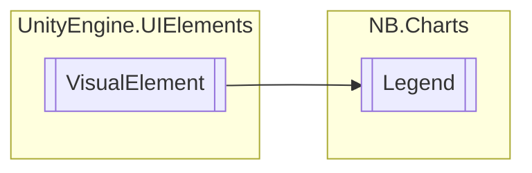

# Legend `class`

## Diagram


## Members
### Properties
#### Public  properties
| Type | Name | Methods |
| --- | --- | --- |
| `Action`&lt;`string`&gt; | [`OnToggleSeries`](#ontoggleseries) | `get, set` |

### Methods
#### Public  methods
| Returns | Name |
| --- | --- |
| `void` | [`AddEntry`](#addentry)(`string` name, `Color` color) |
| `void` | [`RemoveEntry`](#removeentry)(`string` name) |
| `void` | [`SetColor`](#setcolor)(`Color` color, `string` name) |

## Details
### Inheritance
 - `VisualElement`

### Nested types
#### Classes
 - `UxmlTraits`

### Constructors
#### Legend
```csharp
public Legend()
```

### Methods
#### AddEntry
```csharp
public void AddEntry(string name, Color color)
```
##### Arguments
| Type | Name | Description |
| --- | --- | --- |
| `string` | name |   |
| `Color` | color |   |

#### RemoveEntry
```csharp
public void RemoveEntry(string name)
```
##### Arguments
| Type | Name | Description |
| --- | --- | --- |
| `string` | name |   |

#### SetColor
```csharp
public void SetColor(Color color, string name)
```
##### Arguments
| Type | Name | Description |
| --- | --- | --- |
| `Color` | color |   |
| `string` | name |   |

### Properties
#### OnToggleSeries
```csharp
public Action<string> OnToggleSeries { get; set; }
```
