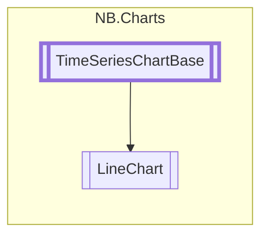

# LineChart `class`

## Diagram


## Members
### Properties
#### Public  properties
| Type | Name | Methods |
| --- | --- | --- |
| `float` | [`DefaultDataWidth`](#defaultdatawidth)<br>Default width of line traces | `get, set` |
| `string` | [`MarkerClass`](#markerclass)<br>Custom USS class to assign to all marker glyphs. | `get, set` |
| `bool` | [`ShowMarkers`](#showmarkers)<br>If true, will display additional marker glyphs<br>            on each datapoint. | `get, set` |
| `bool` | [`SmearMarkerUpdates`](#smearmarkerupdates)<br>Because updating large sets of marker glyphs can be expensive,<br>            setting this to true will spread glyph updates across multiple<br>            frames. This can yield a smoother experience, but comes with<br>            the cost of some visual artifacts during frequent updates. | `get, set` |

### Methods
#### Public  methods
| Returns | Name |
| --- | --- |
| `void` | [`RemoveDataSeries`](#removedataseries)(`string` series) |
| `void` | [`SetLineWidth`](#setlinewidth)(`float` width, `string` series)<br>Sets the line width of an individual data series without affecting others. |

#### Protected  methods
| Returns | Name |
| --- | --- |
| `void` | [`DrawChart`](#drawchart)(`Painter2D` p, `MeshGenerationContext` mgc, `Vector2` dataRangeX, `Vector2` dataRangeY, `Vector2` eleRangeX, `Vector2` eleRangeY) |
| `void` | [`OnRefreshVisuals`](#onrefreshvisuals)() |

## Details
### Inheritance
 - [
`TimeSeriesChartBase`
](./nbcharts-TimeSeriesChartBase.md)

### Nested types
#### Classes
 - `UxmlFactory`
 - `UxmlTraits`

### Constructors
#### LineChart
```csharp
public LineChart()
```

### Methods
#### RemoveDataSeries
```csharp
public override void RemoveDataSeries(string series)
```
##### Arguments
| Type | Name | Description |
| --- | --- | --- |
| `string` | series |   |

#### DrawChart
```csharp
protected override void DrawChart(Painter2D p, MeshGenerationContext mgc, Vector2 dataRangeX, Vector2 dataRangeY, Vector2 eleRangeX, Vector2 eleRangeY)
```
##### Arguments
| Type | Name | Description |
| --- | --- | --- |
| `Painter2D` | p |   |
| `MeshGenerationContext` | mgc |   |
| `Vector2` | dataRangeX |   |
| `Vector2` | dataRangeY |   |
| `Vector2` | eleRangeX |   |
| `Vector2` | eleRangeY |   |

#### SetLineWidth
```csharp
public void SetLineWidth(float width, string series)
```
##### Arguments
| Type | Name | Description |
| --- | --- | --- |
| `float` | width | Width, in pixels |
| `string` | series | Name of the series to modify |

##### Summary
Sets the line width of an individual data series without affecting others.

#### OnRefreshVisuals
```csharp
protected override void OnRefreshVisuals()
```

### Properties
#### DefaultDataWidth
```csharp
public float DefaultDataWidth { get; set; }
```
##### Summary
Default width of line traces

#### ShowMarkers
```csharp
public bool ShowMarkers { get; set; }
```
##### Summary
If true, will display additional marker glyphs
            on each datapoint.

#### MarkerClass
```csharp
public string MarkerClass { get; set; }
```
##### Summary
Custom USS class to assign to all marker glyphs.

#### SmearMarkerUpdates
```csharp
public bool SmearMarkerUpdates { get; set; }
```
##### Summary
Because updating large sets of marker glyphs can be expensive,
            setting this to true will spread glyph updates across multiple
            frames. This can yield a smoother experience, but comes with
            the cost of some visual artifacts during frequent updates.
