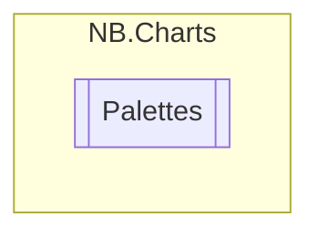

# Palettes `enum`

## Description
Available built-int color palettes

## Diagram

## Details
### Summary
Available built-int color palettes

### Fields
#### C_Geometry
##### Summary
A palette designed for geometric data (e.g. positions, velocities, ..)
            based on the Solarized palette. Begins with red, green, and blue hues.

#### C_Pastels

#### C_Solarized
##### Summary
A palette adapted from the solarized color palette.

#### C_Tableau10

#### S_Blue2Yellow

#### D_Blue2Red

#### D_Teal2Pink

#### Random
##### Summary
Selects a random color each time a new value is requested.
