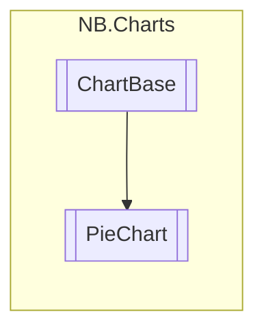

# PieChart `class`

## Description
A basic pie chart element.

## Diagram


## Members
### Properties
#### Public  properties
| Type | Name | Methods |
| --- | --- | --- |
| `Color` | [`BorderColor`](#bordercolor)<br>Color of the border between pie slices | `get, set` |

### Methods
#### Protected  methods
| Returns | Name |
| --- | --- |
| `void` | [`DrawChart`](#drawchart)(`Painter2D` p, `MeshGenerationContext` mgc, `Vector2` dataRangeX, `Vector2` dataRangeY, `Vector2` eleRangeX, `Vector2` eleRangeY) |
| `void` | [`GenerateVisualContent`](#generatevisualcontent)(`MeshGenerationContext` mgc) |

## Details
### Summary
A basic pie chart element.

### Inheritance
 - `ChartBase`&lt;(`string` Item1, `float` Item2)&gt;

### Nested types
#### Classes
 - `UxmlFactory`
 - `UxmlTraits`

### Constructors
#### PieChart
```csharp
public PieChart()
```

### Methods
#### DrawChart
```csharp
protected override void DrawChart(Painter2D p, MeshGenerationContext mgc, Vector2 dataRangeX, Vector2 dataRangeY, Vector2 eleRangeX, Vector2 eleRangeY)
```
##### Arguments
| Type | Name | Description |
| --- | --- | --- |
| `Painter2D` | p |   |
| `MeshGenerationContext` | mgc |   |
| `Vector2` | dataRangeX |   |
| `Vector2` | dataRangeY |   |
| `Vector2` | eleRangeX |   |
| `Vector2` | eleRangeY |   |

#### GenerateVisualContent
```csharp
protected override void GenerateVisualContent(MeshGenerationContext mgc)
```
##### Arguments
| Type | Name | Description |
| --- | --- | --- |
| `MeshGenerationContext` | mgc |   |

### Properties
#### BorderColor
```csharp
public Color BorderColor { get; set; }
```
##### Summary
Color of the border between pie slices
