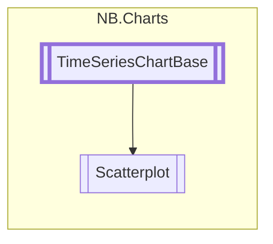

# Scatterplot `class`

## Diagram


## Members
### Properties
#### Public  properties
| Type | Name | Methods |
| --- | --- | --- |
| `float` | [`DefaultDataWidth`](#defaultdatawidth) | `get, set` |
| `string` | [`MarkerClass`](#markerclass)<br>Custom USS class to assign to all marker glyphs. | `get, set` |
| `float` | [`OverlapDistance`](#overlapdistance)<br>Markers from the same series which are less than OverlapDistance pixels<br>            apart will not be drawn. This prevents stacking of tons and tons of<br>            overlapping markers in cases where the distance between them is very small.<br>            For dense datasets, it may be a good idea to set this to a value close to<br>            the width of your markers. | `get, set` |
| `bool` | [`SmearMarkerUpdates`](#smearmarkerupdates)<br>Because updating large sets of marker glyphs can be expensive,<br>            setting this to true will spread glyph updates across multiple<br>            frames. This can yield a smoother experience, but comes with<br>            the cost of some visual artifacts during frequent updates. | `get, set` |

### Methods
#### Public  methods
| Returns | Name |
| --- | --- |
| `void` | [`RemoveDataSeries`](#removedataseries)(`string` series) |
| `void` | [`SetMarkerClass`](#setmarkerclass)(`string` className, `string` series)<br>Sets a custom USS class for markers in a particular series |

#### Protected  methods
| Returns | Name |
| --- | --- |
| `void` | [`DrawChart`](#drawchart)(`Painter2D` p, `MeshGenerationContext` mgc, `Vector2` dataRangeX, `Vector2` dataRangeY, `Vector2` eleRangeX, `Vector2` eleRangeY) |
| `void` | [`OnRefreshVisuals`](#onrefreshvisuals)() |

## Details
### Inheritance
 - [
`TimeSeriesChartBase`
](./nbcharts-TimeSeriesChartBase.md)

### Nested types
#### Classes
 - `UxmlFactory`
 - `UxmlTraits`

### Constructors
#### Scatterplot
```csharp
public Scatterplot()
```

### Methods
#### RemoveDataSeries
```csharp
public override void RemoveDataSeries(string series)
```
##### Arguments
| Type | Name | Description |
| --- | --- | --- |
| `string` | series |   |

#### DrawChart
```csharp
protected override void DrawChart(Painter2D p, MeshGenerationContext mgc, Vector2 dataRangeX, Vector2 dataRangeY, Vector2 eleRangeX, Vector2 eleRangeY)
```
##### Arguments
| Type | Name | Description |
| --- | --- | --- |
| `Painter2D` | p |   |
| `MeshGenerationContext` | mgc |   |
| `Vector2` | dataRangeX |   |
| `Vector2` | dataRangeY |   |
| `Vector2` | eleRangeX |   |
| `Vector2` | eleRangeY |   |

#### OnRefreshVisuals
```csharp
protected override void OnRefreshVisuals()
```

#### SetMarkerClass
```csharp
public void SetMarkerClass(string className, string series)
```
##### Arguments
| Type | Name | Description |
| --- | --- | --- |
| `string` | className | USS Class to apply |
| `string` | series | Series to apply the class to |

##### Summary
Sets a custom USS class for markers in a particular series

### Properties
#### DefaultDataWidth
```csharp
public float DefaultDataWidth { get; set; }
```

#### MarkerClass
```csharp
public string MarkerClass { get; set; }
```
##### Summary
Custom USS class to assign to all marker glyphs.

#### SmearMarkerUpdates
```csharp
public bool SmearMarkerUpdates { get; set; }
```
##### Summary
Because updating large sets of marker glyphs can be expensive,
            setting this to true will spread glyph updates across multiple
            frames. This can yield a smoother experience, but comes with
            the cost of some visual artifacts during frequent updates.

#### OverlapDistance
```csharp
public float OverlapDistance { get; set; }
```
##### Summary
Markers from the same series which are less than OverlapDistance pixels
            apart will not be drawn. This prevents stacking of tons and tons of
            overlapping markers in cases where the distance between them is very small.
            For dense datasets, it may be a good idea to set this to a value close to
            the width of your markers.
