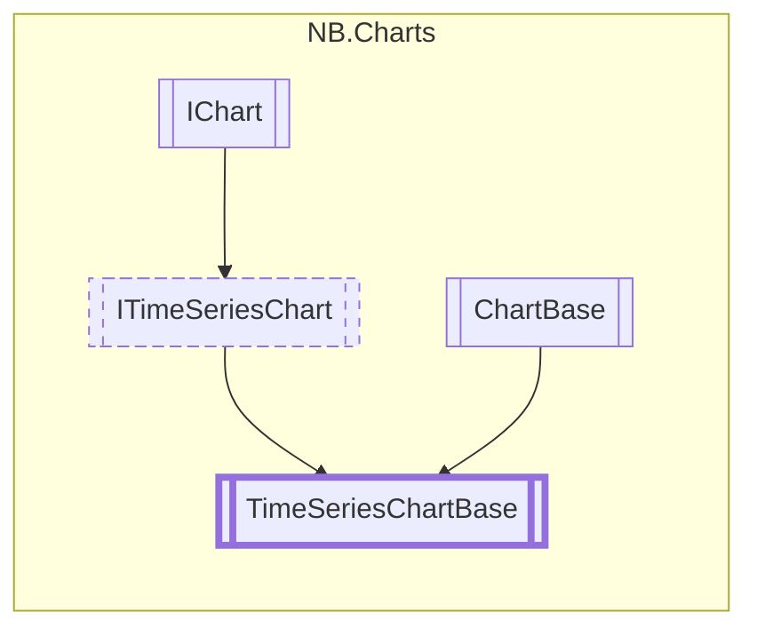

# TimeSeriesChartBase `class`

## Diagram


## Members
### Properties
#### Public  properties
| Type | Name | Methods |
| --- | --- | --- |
| `string` | [`GridLabelFormatString`](#gridlabelformatstring) | `get, set` |
| `bool` | [`MajorGridAutoSpacingHorizontal`](#majorgridautospacinghorizontal) | `get, set` |
| `bool` | [`MajorGridAutoSpacingVertical`](#majorgridautospacingvertical) | `get, set` |
| `Color` | [`MajorGridColor`](#majorgridcolor) | `get, set` |
| `float` | [`MajorGridLabelFontSize`](#majorgridlabelfontsize) | `get, set` |
| `float` | [`MajorGridLineWidth`](#majorgridlinewidth) | `get, set` |
| `bool` | [`ShowMajorGrid`](#showmajorgrid) | `get, set` |
| `bool` | [`ShowMajorGridLabelsHorizontal`](#showmajorgridlabelshorizontal) | `get, set` |
| `bool` | [`ShowMajorGridLabelsVertical`](#showmajorgridlabelsvertical) | `get, set` |

### Methods
#### Public  methods
| Returns | Name |
| --- | --- |
| `void` | [`AddGridLine`](#addgridline)([`GridDirection`](./nbcharts-GridDirection.md) direction, `float` position) |
| `void` | [`ClearGridLines`](#cleargridlines)() |
| `void` | [`SetDataRangeX`](#setdatarangex)(`float` lower, `float` upper) |
| `void` | [`SetDataRangeY`](#setdatarangey)(`float` lower, `float` upper) |

#### Protected  methods
| Returns | Name |
| --- | --- |
| `void` | [`GenerateVisualContent`](#generatevisualcontent)(`MeshGenerationContext` mgc) |

## Details
### Inheritance
 - [
`ITimeSeriesChart`
](./nbcharts-ITimeSeriesChart.md)
 - `IChart`&lt;`IList`&lt;`Vector2`&gt;&gt;
 - `ChartBase`&lt;`IList`&lt;`Vector2`&gt;&gt;

### Nested types
#### Classes
 - `UxmlTraits`

### Constructors
#### TimeSeriesChartBase
```csharp
protected TimeSeriesChartBase()
```

### Methods
#### AddGridLine
```csharp
public virtual void AddGridLine(GridDirection direction, float position)
```
##### Arguments
| Type | Name | Description |
| --- | --- | --- |
| [`GridDirection`](./nbcharts-GridDirection.md) | direction |   |
| `float` | position |   |

#### ClearGridLines
```csharp
public virtual void ClearGridLines()
```

#### SetDataRangeX
```csharp
public virtual void SetDataRangeX(float lower, float upper)
```
##### Arguments
| Type | Name | Description |
| --- | --- | --- |
| `float` | lower |   |
| `float` | upper |   |

#### SetDataRangeY
```csharp
public virtual void SetDataRangeY(float lower, float upper)
```
##### Arguments
| Type | Name | Description |
| --- | --- | --- |
| `float` | lower |   |
| `float` | upper |   |

#### GenerateVisualContent
```csharp
protected override void GenerateVisualContent(MeshGenerationContext mgc)
```
##### Arguments
| Type | Name | Description |
| --- | --- | --- |
| `MeshGenerationContext` | mgc |   |

### Properties
#### MajorGridColor
```csharp
public virtual Color MajorGridColor { get; set; }
```

#### MajorGridLineWidth
```csharp
public virtual float MajorGridLineWidth { get; set; }
```

#### ShowMajorGrid
```csharp
public virtual bool ShowMajorGrid { get; set; }
```

#### ShowMajorGridLabelsHorizontal
```csharp
public virtual bool ShowMajorGridLabelsHorizontal { get; set; }
```

#### ShowMajorGridLabelsVertical
```csharp
public virtual bool ShowMajorGridLabelsVertical { get; set; }
```

#### MajorGridLabelFontSize
```csharp
public float MajorGridLabelFontSize { get; set; }
```

#### MajorGridAutoSpacingHorizontal
```csharp
public bool MajorGridAutoSpacingHorizontal { get; set; }
```

#### MajorGridAutoSpacingVertical
```csharp
public bool MajorGridAutoSpacingVertical { get; set; }
```

#### GridLabelFormatString
```csharp
public string GridLabelFormatString { get; set; }
```
