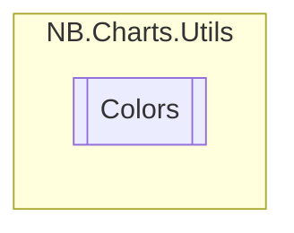

# Colors `class`

## Diagram


## Members
### Methods
#### Public Static methods
| Returns | Name |
| --- | --- |
| `Color` | [`FromPalette`](#frompalette)([`Palettes`](./nbcharts-Palettes.md) palette, `int` idx) |
| `Color` | [`RandNice`](#randnice)()<br>Generates a random but nice-looking color |

## Details
### Methods
#### RandNice
```csharp
public static Color RandNice()
```
##### Summary
Generates a random but nice-looking color

#### FromPalette
```csharp
public static Color FromPalette(Palettes palette, int idx)
```
##### Arguments
| Type | Name | Description |
| --- | --- | --- |
| [`Palettes`](./nbcharts-Palettes.md) | palette |   |
| `int` | idx |   |
