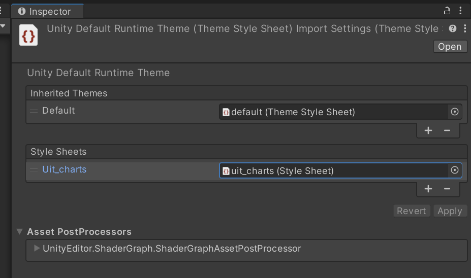

# UIToolkit charts & plotting

## [API Documentation](./.github/doc/)

## Current Supported Chart Types
* [Scatterplot](./.github/doc/nbcharts-Scatterplot.md)
* [Line chart](./.github/doc/nbcharts-LineChart.md)
* [Pie chart](./.github/doc/nbcharts-PieChart.md)

## Installation Instructions
1. In Unity, open the Package Manager (`Window -> Package Manager`)
2. In the Add Package menu, choose `Add package from git url...`
3. Enter `git@github.com:noirb/uit_charts.git` to get the latest version.
    * You can specify an explicit version by appending a tag or commit hash to the end of the URL:
      ```
      git@github.com:noirb/uit_charts.git#v1.0.0
      ```

## Setup & Styling
To ensure charts render correctly, you need to add the [default stylesheet](https://github.com/noirb/UIT_Charts/blob/main/Runtime/styles/uit_charts.uss) to your theme `.tss`. If you're not sure which theme is being used, check the `PanelSettings` in your project.



The default stylesheet primarily defines some basic flex behavior, relative layout of certain elements, and provides a default color scheme to ensure that the plots are generally usable out-of-the-box. They are intended to be overridden depending on your needs. For example, if you need your plots to line up very tightly against other UI Elements and are not using axis labels, you can set the `width` of `.nb-chart__axis-label__left` to `0`, effectively collapsing the label area and making the left edge of the plot line up with the left edge of the element containing it.

The Scatter and Line plot classes also each have a `MarkerClass` property. You can set this in code ur UXML to apply a custom USS class to all markers created within the plot, effectively overriding the default marker style without needing to look it up (or to allow you to apply different styles to different plots in the same scene).

## UXML Example

An example showing how plots can be integrated into the UI via UXML, with several customized properties:
```xml
<ui:UXML xmlns:ui="UnityEngine.UIElements" xmlns:uie="UnityEditor.UIElements" xsi="http://www.w3.org/2001/XMLSchema-instance" engine="UnityEngine.UIElements" editor="UnityEditor.UIElements" noNamespaceSchemaLocation="../../../UIElementsSchema/UIElements.xsd" editor-extension-mode="False">
    <ui:VisualElement name="root" style="flex-grow: 1; background-color: rgba(0, 0, 0, 0); width: 100%; height: 100%;">
        <ui:TwoPaneSplitView name="SplitRoot" fixed-pane-initial-dimension="600" picking-mode="Ignore" fixed-pane-index="1" orientation="Horizontal" style="background-color: rgba(43, 62, 62, 0); width: 100%; height: 100%; flex-shrink: 0;">
            <ui:TwoPaneSplitView name="SplitTwo" fixed-pane-initial-dimension="600" picking-mode="Ignore" fixed-pane-index="1" orientation="Vertical" style="background-color: rgba(43, 62, 62, 0); width: 100%; height: 100%; flex-shrink: 0;">
                <!-- top left plot -->
                <NB.Charts.LineChart major-grid-color="#412F2FFF" default-data-color="#802F2FFF" color-palette="C_Pastels" axis-label-left="Left Label" axis-label-right="Right Label" show-markers="false" marker-class="nb-chart-lineplot__marker-square" style="height: 256px; transform-origin: center;" />
                <!-- bottom left plot -->
                <NB.Charts.LineChart major-grid-color="#2F3A5AFF" default-data-color="#802F2FFF" color-palette="C_Solarized" axis-label-left="Left Label" axis-label-right="Right Label" show-markers="false" marker-class="nb-chart-lineplot__marker-square" style="height: 256px; transform-origin: center;" />

            </ui:TwoPaneSplitView>
            <ui:TwoPaneSplitView name="SplitThree" fixed-pane-initial-dimension="600" picking-mode="Ignore" fixed-pane-index="1" orientation="Vertical" style="background-color: rgba(43, 62, 62, 0); width: 100%; height: 100%; flex-shrink: 0;">
                <ui:VisualElement style="flex-grow: 1; background-color: rgba(0, 49, 101, 0.67); width: 100%; height: 256px; max-width: 100%; max-height: 100%;">
                    <!-- top right plot -->
                    <NB.Charts.LineChart major-grid-color="#2F413AFF" default-data-color="#802F2FFF" color-palette="C_Tableau10" axis-label-left="Left Label" axis-label-right="Right Label" show-markers="false" marker-class="nb-chart-lineplot__marker-square" style="height: 256px; transform-origin: center;" />

                </ui:VisualElement>
                <ui:VisualElement style="flex-grow: 1; background-color: rgba(0, 49, 101, 0.67); width: 100%; height: 256px; max-width: 100%; max-height: 100%;">
                    <!-- bottom right plot -->
                    <NB.Charts.LineChart major-grid-color="#FDFDFDFF" default-data-color="#802F2FFF" color-palette="C_Geometry" axis-label-left="Left Label" axis-label-right="Right Label" show-markers="false" marker-class="nb-chart-lineplot__marker-square" major-grid-line-width="1" style="height: 256px; transform-origin: center;" />

                </ui:VisualElement>
            </ui:TwoPaneSplitView>
        </ui:TwoPaneSplitView>
    </ui:VisualElement>
</ui:UXML>
```

